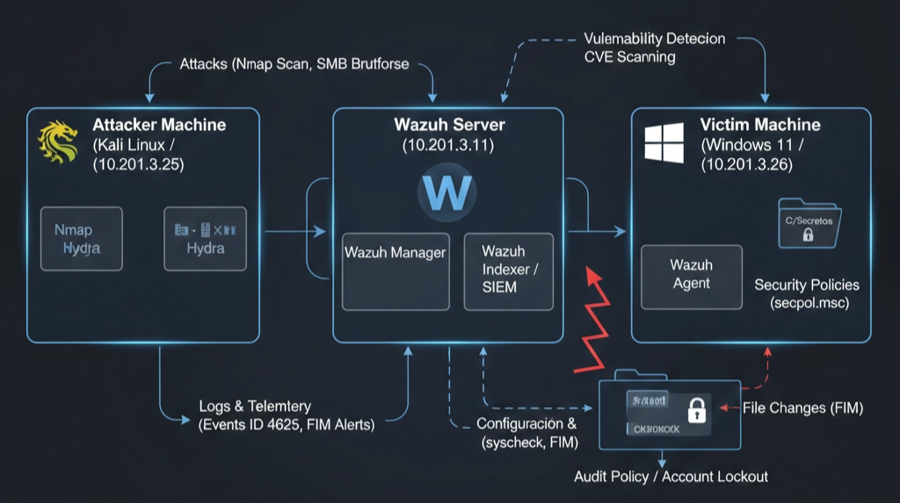

# Despliegue de un SIEM con Análisis Y Ataques reales

[Pulse aqui para ver la planificación](Pulse%20aqui%20para%20ver%20la%20planificaci%C3%B3n%2030c36b3d85e2802da69ae72bf5e8b4ac.md)

Este proyecto consiste en el despliegue de un entorno de laboratorio técnico para simular las operaciones de un **SOC (Security Operations Center)**. El objetivo principal es demostrar la capacidad de monitorización centralizada, análisis de eventos de seguridad y respuesta ante incidentes utilizando la plataforma **Wazuh**.

### Objetivos Técnicos

- **Visibilidad y Monitorización:** Despliegue de un servidor SIEM y configuración de agentes en endpoints críticos (Windows 11) para la recolección de logs y telemetría.
- **Gestión de Vulnerabilidades:** Implementación de escaneos automatizados para identificar fallos de configuración y parches pendientes en los activos.
- **Detección de Amenazas:** Simulación de ataques reales (Reconocimiento, Fuerza Bruta y Alteración de Integridad) para validar la eficacia de las reglas de detección.
- **Respuesta ante Incidentes:** Documentación de procedimientos técnicos y análisis de alertas para la mitigación de riesgos en entornos de red.

### Stack Tecnológico

- **SIEM:** Wazuh.
- **Sistemas Operativos:** Windows 11 (Endpoint), Kali Linux (Atacante).
- **Herramientas de Red:** Nmap, Hydra, Wireshark.
- **Virtualización:** Oracle VirtualBox.

Con las 3 Maquinas listas procedemos a empezar el laboratorio


# 1.Windows 11

Comprobamos direcciones IP de las 3 maquinas (en mi caso son las siguientes). Importante que trabajen en el mismo rango

| **Dispositivo** | **Dirección IP** | **Rol** |
| --- | --- | --- |
| **Wazuh Server** | `10.201.3.11` | SIEM / Manager  |
| **Víctima** | `10.201.3.26` | Endpoint Monitorizado |
| **Atacante** | `10.201.3.25` | Generador de Amenazas |


Y comprobamos la conectividad entre maquina con el comando ping. en mi caso desde el kali linux al servidor Wazuh y a la maquina Windows

“Importante en Windows desactivar el firewall ya que bloquea el ICMP por defecto”


y como podemos observar hay conexión 


1. En el buscador de la maquina Windows ya que va a actuar como cerebro nos vamos al siguiente enlace  `https://10.201.3.11`.
Nos aparecerá lo siguiente ya que es normal que no la reconozca, pero le daremos a avanzado y continuar, con eso accederemos al servidor wazuh


1. Ingresamos el usuario y contraseña: admin / admin y ya estaremos dentro
2. Generamos el Agente clickando en “Deploy New Agent”
    
    Seleccionamos Windows:
    
    
    

Añadimos la dirección IP


Insertamos el nombre 


1. Ejecutamos en powershell el comando que nos proporciona


1. Con esto conseguimos  que se inicie el servidor y realice una conectividad exitosa 


# 2.Fase Ataque “Kali Linux”

1. Ejecutamos el siguiente comando “sudo nmap -sS -Pn 10.201.3.26”
    
    Con esto conseguimos realizar un escaneo de puertos  sigiloso
    
    
    
    Podemos observar los 3 servicios de Windows activos 
    

1. En la maquina Windows volvemos a nuestro agente


Accedemos a Threat Hunting y clickamos en Events


Con esto vemos todos los eventos que ha detectado, pero ¿Y el comando NMAP desde el kali?. Bueno este comando no lo ha detectado, solo conseguimos ver las instalaciones que hemos realizado, por eso vamos a hacer un ataque a fuerza bruta para que el servidor Wazuh detecte la alerta, para ello nos vamos a la maquina Kali y ejecutamos lo siguiente

- `sudo hydra -l admin -P /usr/share/wordlists/fasttrack.txt 10.201.3.26 smb`
- Click aqui para ver ¿Cómo se forma este comando?
    
    **`sudo`**
    
    Ejecuta la herramienta con privilegios de superusuario (necesario en Kali para acceder a ciertos recursos de red).
    
    **`hydra`**
    
    Invoca la herramienta de cracking de login en red que permite probar múltiples combinaciones de credenciales.
    
    - `l admin`
    
    Especifica un **nombre de usuario único** para el ataque. En este caso, el objetivo es la cuenta "admin".
    
    ```
    login
    ```
    
    - `P [ruta]`
    
    Indica la ruta al **diccionario de contraseñas**
    
    ```
    wordlist
    ```
    
    y se utilizó , un listado estándar que contiene las contraseñas más comunes.
    
    ```
    fasttrack.txt
    ```
    
    **`10.201.3.26`**
    
    Es la **dirección IP del objetivo**
    
    **`smb`**
    
    Define el **protocolo** que se va a atacar. SMB (Server Message Block) es el servicio que Windows usa para compartir archivos e impresoras (puerto 445).
    

Este comando simula un ataque de **fuerza bruta basado en diccionario**. Desde el punto de vista de la monitorización, este tráfico genera una ráfaga de eventos de 'Login Failure' (ID de evento de Windows 4625). Un SIEM como Wazuh está configurado para detectar la frecuencia de estos fallos; cuando superan un umbral (10 fallos en 1 minuto), el sistema genera una alerta de nivel alto por posible intento de intrusión

Si nos vamos a Eventos y refrescamos podemos ver como ha detectado la auditoria de inicio de sesión no valido 


Por si esto no es suficiente vamos a probar a crear un FIM (File Integrity Monitoring) para ello Crearemos un archivo "secreto" en el escritorio de Windows y veremos cómo Wazuh te avisa en segundos si alguien lo toca o lo borra.


Una vez creado esto ejecutamos lo siguiente

$confPath = "C:\Program Files (x86)\ossec-agent\ossec.conf"

$nuevaConfig = '    <directories check_all="yes" report_changes="yes" realtime="yes">C:\Secretos</directories>'

(Get-Content $confPath) | ForEach-Object {
$_
if ($_ -match "<syscheck>") { $nuevaConfig }
} | Set-Content $confPath

Con este comando le estamos indicando al servidor Wazuh que ponga su atencion en ese fichero y que lo vigile pase lo que pase, por eso al modificarlo despues nos deberia alertar ya que manualmente lo hemos asignado asi 

y reiniciamos el servicio con restart-Service WazuhSvc

Por ultimo modificamos el fichero passwords.txt añadiendole cualquier linea y al volver al servidor Wazuh…


Al haberle añadido una línea mas, te esta indicando el porcentaje de línea que se añadió al crearlo y después lo que se modifico en cuanto pusimos la alerta. esta practica puedes aplicarla con ficheros, carpetas personales o importantes, en un entorno de red con dos pequeños pasos puedes aplicarle un nivel de seguridad extra a tus documentos

## El laboratorio ha demostrado con éxito la importancia de la defensa en profundidad. Se observó que un SIEM por sí solo tiene visibilidad limitada si el endpoint no tiene configuradas correctamente sus Directivas de Auditoría. La integración de Wazuh permitió no solo detectar la intrusión  y la manipulación de datos, sino también proporcionar una postura proactiva mediante la gestión de vulnerabilidades, permitiendo al equipo del SOC actuar antes de que las debilidades sean explotadas



## Si te ha resultado útil este laboratorio o quieres intercambiar ideas sobre ciberseguridad y operaciones SOC, no dudes en seguirme o contactarme:

### **LinkedIn:** [https://www.linkedin.com/in/sergio-garcia-roldan-8677a9339/](https://www.linkedin.com/in/sergio-garcia-roldan-8677a9339/)

### **GitHub:** [https://github.com/uSearchg](https://github.com/uSearchg)


